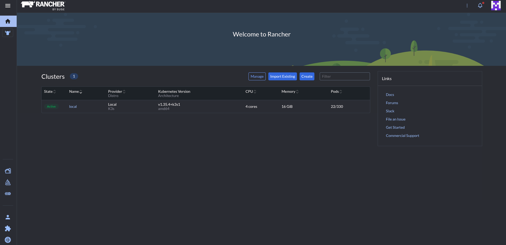

To get started with rancher we need to install helm onto our controller plane.
Helm is a package manager for k8s and we can use this to install Rancher. 

You can find the helms install guide [by clicking 'here'](https://helm.sh/docs/intro/install/). I ran

<br />

```bash
curl -fsSL -o get_helm.sh https://raw.githubusercontent.com/helm/helm/main/scripts/get-helm-4
chmod 700 get_helm.sh
./get_helm.sh
```

<br />

Then I ensured my k3s config file was set.

<br />

```bash
echo export "KUBECONFIG=/etc/rancher/k3s/k3s.yaml" >> ~/.bashrc
```
<br />

and to ensure it was persistent by setting it in my environment file where than can log in and out or can run.

<br />

```bash
source ~/.bashrc
```

<br />

Next I added the rancher repo using helm

<br />

```bash
helm repo add rancher-latest https://releases.rancher.com/server-charts/latest
helm repo update
```

<br />

---

<br />

We need to create a namespace in k3s. Name spaces are used to create sort of isolated segments good for keeping things organised

<br />

```bash
kubectl create namespace cattle-system
[root@k3s-man-01 ~]# kubectl get namespaces
NAME              STATUS   AGE
cattle-system     Active   3d23h
```

<br />

---

<br />

Next step is a CRD. This stands for `Custom Resource Definition` its how we can get k3s to learn / use new objects and expand upon it.

<br />

```bash
kubectl apply -f https://github.com/cert-manager/cert-manager/releases/download/v1.18.2/cert-manager.crds.yaml
```

<br />

Then we can get our cert-manager to issue our certs for our k3s cluster and rancher

<br />

```bash
kubectl apply -f https://github.com/cert-manager/cert-manager/releases/download/v1.18.2/cert-manager.crds.yaml
helm install cert-manager jetstack/cert-manager \
  --namespace cert-manager \
  --create-namespace
```

<br />

We can view the cert manager in our pods now its been installed

<br />

```bash
[root@k3s-man-01 ~]# kubectl get pods -n cert-manager
NAME                                       READY   STATUS    RESTARTS        AGE
cert-manager-5957746d66-bs5r6              1/1     Running   4 (5h52m ago)   24h
cert-manager-cainjector-567c6b47ff-7hcpb   1/1     Running   3 (9h ago)      24h
cert-manager-webhook-7cc5c588cb-wpc7s      1/1     Running   0               24h
[root@k3s-man-01 ~]#
```
<br />

---

<br />

Now to install rancher onto our control plane
<br />
```bash
helm install rancher rancher-latest/rancher \
  --namespace cattle-system \
  --set hostname=rancher.Yourdomain \
  --set replicas=1
```

<br />
<br />

```bash
NAME: rancher
LAST DEPLOYED: Mon May 18 22:43:55 2026
NAMESPACE: cattle-system
STATUS: deployed
REVISION: 1
TEST SUITE: None
NOTES:
Rancher Server has been installed. Rancher may take several minutes to fully initialize.

Please standby while Certificates are being issued, Containers are started and the Ingress rule comes up.

Check out our docs at https://rancher.com/docs/

## First Time Login

If you provided your own bootstrap password during installation, browse to https://rancher.192.168.0.84.sslip.io to get started.
If this is the first time you installed Rancher, get started by running this command and clicking the URL it generates:


echo https://rancherserver/dashboard/?setup=$(kubectl get secret --namespace cattle-system bootstrap-secret -o go-template='{{.data.bootstrapPassword|base64decode}}')


To get just the bootstrap password on its own, run:


kubectl get secret --namespace cattle-system bootstrap-secret -o go-template='{{.data.bootstrapPassword|base64decode}}{{ "\n" }}'


Happy Containering!
```

<br />
<br />
<br />
<br />




